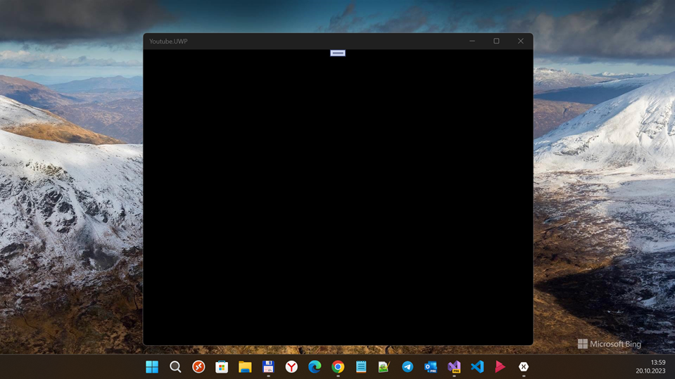

# MyYoutubeX (*master* branch)

My fast and little RnD of MyYoutubeXamarinForm project. 

## Screenshot(s)

## About the original
MyYoutube is a youtube application. Which are using Youtube API from google. It was developing base on Xamarin form.

## My 2 cents
- Portable -> "Sharable"
- Modern Xamarin Forms 5.0
- Modern Prism
- Min. Win. os build = 19041 (no W10M compatibility at now)
 

## Result
- Draft / Damaged (very strange work of any view...)
- Idk how to debug this "mvvm construction" :( Experienced developer help needed

## Credits
- https://github.com/Englbach Le Thien Hoang aka Englbach, MyYoutubeXamarinForm's developer
- https://github.com/Englbach/MyYoutubeXamarinForm The original XF-Portable-based project

## ..
As is. No support. RnD only. DIY.

## .
[m][e] 2024
